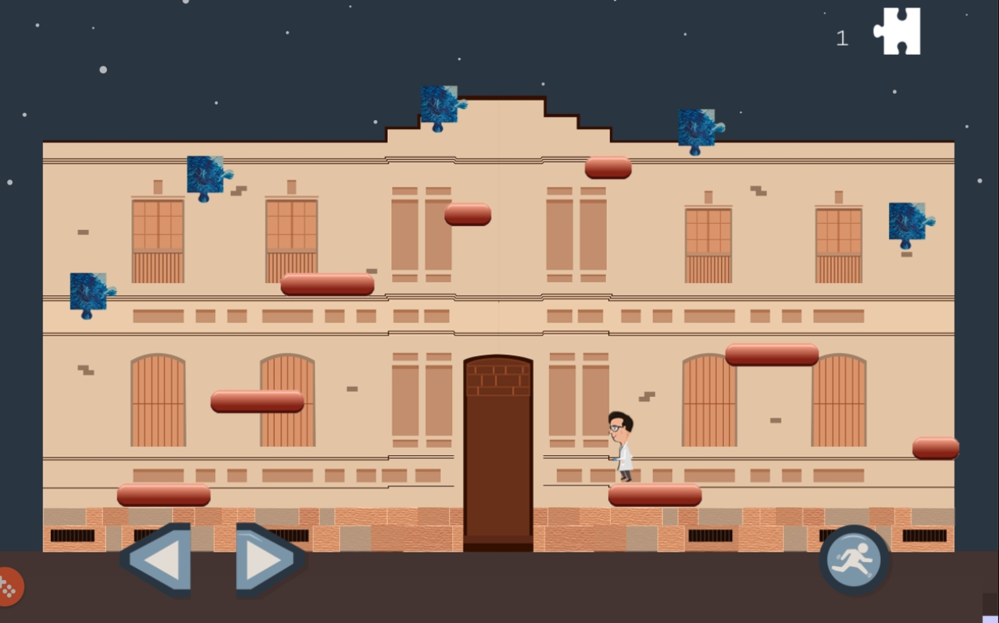
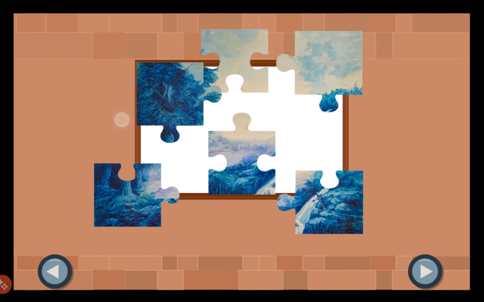
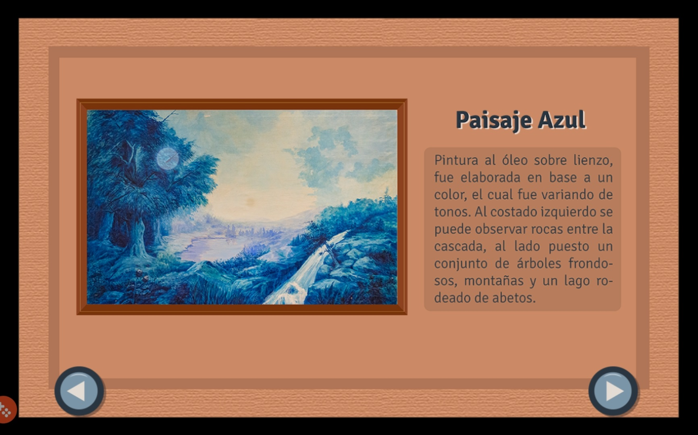
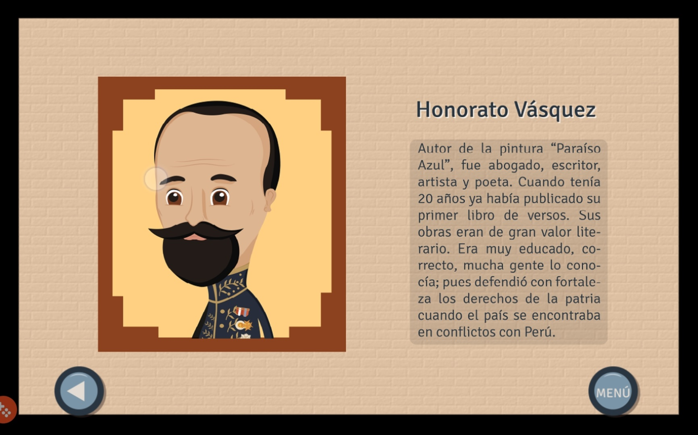

# AventuraEnElMuseo

 

Juego de Plataformas y Puzzles para Tablet usando Phaser3, Ionic y Apache Cordova

 
Demo de juego de plataformas y puzzles

 
 

cd www 
npm init 
npm i --save phaser 
cordova platform add browser 
cordova plugin add cordova-plugin-browsersync 

# Pasos
1. Clonar el repositorio
2. npm install -g cordova
3. npm install
4. cordova platform add <platform name>
5. cordova run <platform name> 
6. cp build.json.example build.json y configurar los parámetros necesarios

 

Se puede usar Apache cordova para android, iOS, web.

 

El programa funcionará en la siguiente ruta: 
http://localhost:8000/index.html

# Demo
https://play.google.com/store/apps/details?id=aventura.enel.museo

 

 
 
 
 
